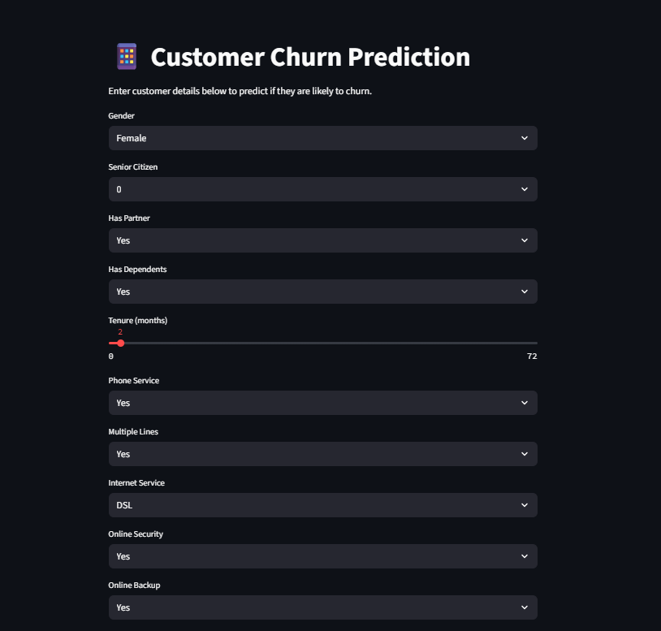
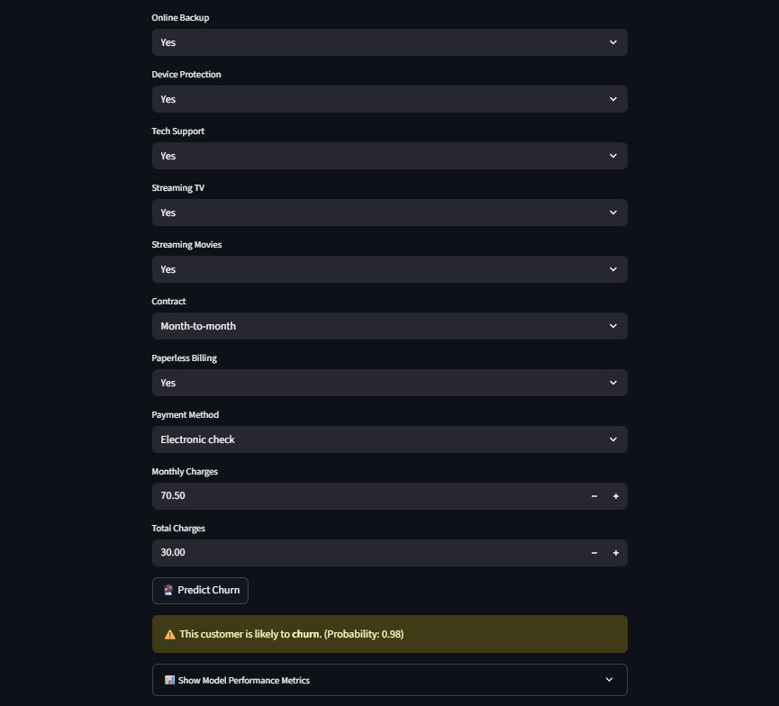

# 📱 Customer Churn Prediction App

This project is a **machine learning web app** built using **Streamlit** that predicts whether a telecom customer is likely to churn or not based on user-input features like contract type, monthly charges, internet service, etc.

---

## 🚀 Live Demo

Try the app live 👉 [Streamlit App](https://churnpredictionapp-yg8jdvnujxdidsrauhlewt.streamlit.app/)

---

## 🧠 Model Details

- **Model Type:** Logistic Regression
- **Training Dataset:** Telecom customer churn data
- **Preprocessing:** Label Encoding, Standard Scaling
- **Accuracy:** 85%
- **Libraries Used:** pandas, scikit-learn, Streamlit, matplotlib, seaborn

---

## ✨ Features

- Predicts customer churn probability.
- Collects input through an interactive UI.
- Displays model evaluation metrics like accuracy, precision, recall, F1-score, and a confusion matrix.
- Easy deployment via Streamlit Cloud.

---

## 📸 Screenshots

**🔹 Input Interface**



**🔹 Prediction Output**



---

## 🧰 Tech Stack

- Python
- pandas
- scikit-learn
- Streamlit
- matplotlib
- seaborn
- pickle (for saving model and encoders)

---

## 📦 Installation

```bash
git clone https://github.com/sam089-glitcher/ChurnPredictionApp.git
cd ChurnPredictionApp
pip install -r requirements.txt
streamlit run app.py
